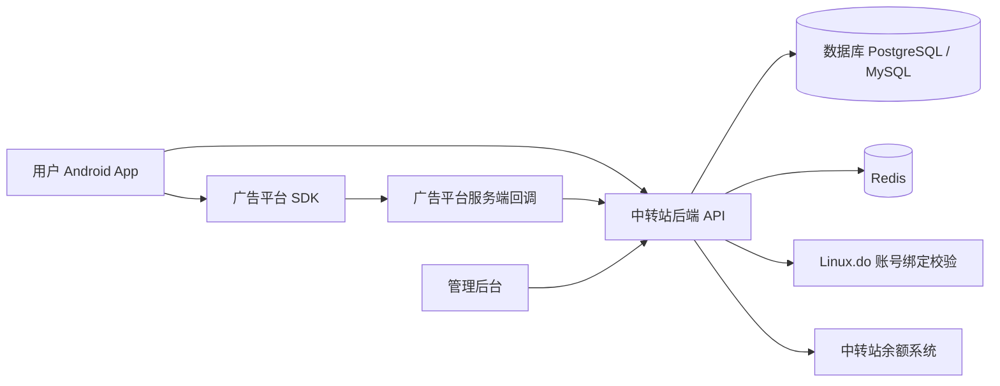
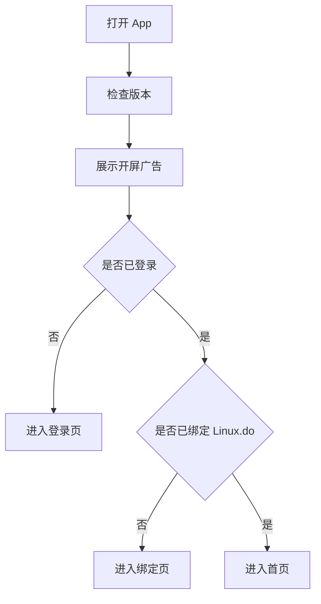
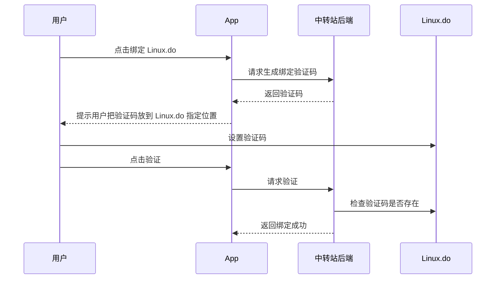
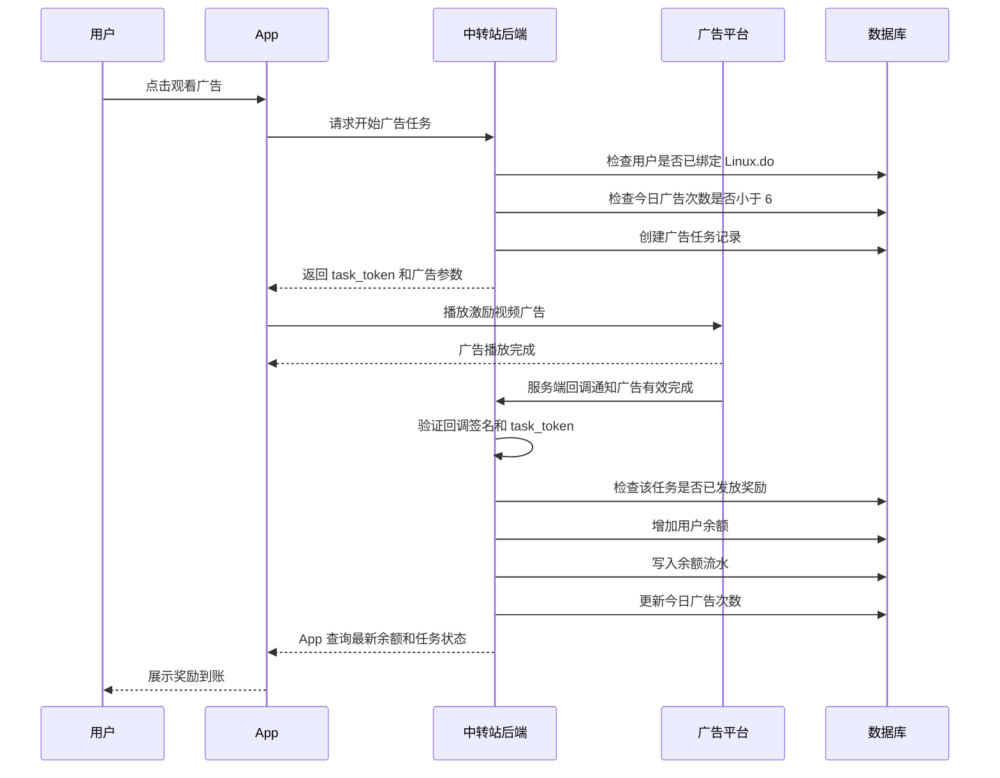

# 公益中转站广告奖励 App 需求与架构文档

## 1. 项目概述

本项目是一个公益性质的中转站 App。用户可以从中转站网站下载 Android App，在 App 中登录并绑定自己的 Linux.do 网站账号。绑定完成后，用户可以通过观看广告任务获得中转站账户余额奖励。

App 不需要上架应用商店，采用 APK 直装方式发布。核心目标是通过广告收益补贴用户的中转站余额，同时保证账号绑定、广告观看、奖励发放和余额记录都由服务器端控制，避免用户通过篡改 App 刷奖励。

## 2. 核心业务模式

用户流程如下：

1. 用户访问中转站网站。
2. 用户下载 Android APK。
3. 用户安装并打开 App。
4. App 启动时展示开屏广告。
5. 用户登录中转站账号。
6. 用户在 App 或中转站中绑定 Linux.do 账号。
7. 绑定成功后，用户进入广告任务页面。
8. 用户每天最多观看 6 次激励视频广告。
9. 每次广告有效观看完成后，系统自动给用户绑定的中转站账户增加余额。
10. 用户可以在 App 中查看：
    - 当前中转站账户余额
    - 今日已观看广告次数
    - 今日剩余广告次数
    - 每次广告获得的余额
    - 历史收益记录

## 3. 重要原则

### 3.1 App 不负责最终记账

App 端只能负责展示页面、播放广告和向后端请求数据，不能由 App 端直接决定是否给用户加余额。

原因：

- APK 可以被反编译或篡改。
- 如果只依赖 App 上报“广告已看完”，很容易被伪造请求。
- 余额属于核心资产，必须由服务器端统一控制。

### 3.2 广告奖励必须以后端为准

建议使用广告平台的服务端回调机制。用户看完激励视频后，由广告平台请求中转站服务器的回调接口，服务器验证回调合法后再给用户增加余额。

### 3.3 Linux.do 密码不应该由本项目收集

不建议让用户在 App 中输入 Linux.do 密码。更安全的绑定方式是：

- 如果 Linux.do 支持 OAuth 或官方 API，则使用官方授权登录。
- 如果没有官方授权，则使用验证码验证方式：
  - 用户在中转站生成一个绑定验证码。
  - 用户将验证码放到 Linux.do 的个人资料、签名、指定帖子或其他可公开验证的位置。
  - 中转站后端读取并验证该验证码。
  - 验证成功后完成绑定。

## 4. 系统整体架构



## 5. 推荐技术栈

### 5.1 App 端

推荐方案：

- Flutter
- 或 Android 原生 Kotlin

如果只做 Android APK，Android Kotlin 更贴近原生广告 SDK；如果未来可能做 iOS 或多端，Flutter 更方便。

### 5.2 后端

推荐方案：

- Node.js + NestJS
- 或 Go + Gin / Fiber
- 或 Java + Spring Boot

后端需要提供 App API、管理后台 API、广告回调接口、余额系统接口。

### 5.3 数据库

推荐：

- PostgreSQL
- 或 MySQL

### 5.4 缓存与限流

推荐：

- Redis

用途：

- 每日广告次数缓存
- 接口限流
- 防重复提交
- 临时绑定验证码
- 风控数据

### 5.5 服务器部署

第一版可以使用一台云服务器：

- Nginx
- 后端 API 服务
- 数据库
- Redis
- 管理后台
- APK 静态下载目录

推荐最低配置：

- 2 核 CPU
- 2GB / 4GB 内存
- 40GB 硬盘
- 3M-5M 带宽起步

## 6. App 功能模块

### 6.1 启动模块

功能：

- 展示启动页
- 检查 App 是否有新版本
- 展示开屏广告
- 判断用户是否已经登录
- 判断用户是否已经绑定 Linux.do 账号

流程：



### 6.2 登录模块

功能：

- 登录中转站账号
- 获取用户 Token
- 保存登录状态
- 退出登录

说明：

用户登录的是自己的中转站账号，不是直接登录 Linux.do 账号。

### 6.3 Linux.do 账号绑定模块

功能：

- 显示当前绑定状态
- 发起绑定
- 验证 Linux.do 账号归属
- 解绑账号
- 重新绑定账号

推荐绑定流程：



### 6.4 广告任务模块

功能：

- 展示今日广告任务
- 每日固定 6 次
- 展示今日已完成次数
- 展示今日剩余次数
- 播放激励视频广告
- 广告完成后展示奖励结果

注意：

- 今日次数必须由后端判断。
- App 不能本地决定是否还有次数。
- 广告奖励金额由后端配置。
- 每次广告任务需要生成一次性的任务 Token。

### 6.5 余额模块

功能：

- 查看当前中转站余额
- 查看广告累计收益
- 查看今日广告收益
- 查看每次广告奖励明细

### 6.6 用户中心模块

功能：

- 显示中转站账号信息
- 显示绑定的 Linux.do 用户名
- 退出登录
- 检查更新
- 查看设备信息
- 联系客服或查看说明

## 7. 广告奖励核心流程

推荐使用服务端回调模式。



## 8. 后端服务模块

### 8.1 用户模块

职责：

- 用户注册/登录
- Token 签发与校验
- 用户资料查询
- 登录状态管理

### 8.2 Linux.do 绑定模块

职责：

- 生成绑定验证码
- 验证 Linux.do 账号归属
- 保存绑定关系
- 解绑
- 防止一个 Linux.do 账号被多个中转站账号重复绑定

### 8.3 广告任务模块

职责：

- 判断用户是否有观看资格
- 创建广告任务
- 校验广告平台回调
- 控制每日观看次数
- 处理奖励发放

### 8.4 钱包余额模块

职责：

- 查询余额
- 增加余额
- 扣减余额
- 写入余额流水
- 保证余额变动可追踪

### 8.5 管理后台模块

职责：

- 查看用户列表
- 查看 Linux.do 绑定关系
- 查看广告任务记录
- 查看余额流水
- 手动调整余额
- 配置每日广告次数
- 配置每次广告奖励金额
- 封禁异常用户
- 查看广告回调日志

### 8.6 App 版本更新模块

职责：

- 返回最新版本号
- 返回 APK 下载地址
- 返回是否强制更新
- 返回更新说明

## 9. 数据库设计

### 9.1 users

用户表。

```sql
CREATE TABLE users (
    id BIGSERIAL PRIMARY KEY,
    username VARCHAR(100),
    email VARCHAR(255),
    phone VARCHAR(50),
    password_hash VARCHAR(255),
    status VARCHAR(30) NOT NULL DEFAULT 'active',
    created_at TIMESTAMP NOT NULL DEFAULT NOW(),
    updated_at TIMESTAMP NOT NULL DEFAULT NOW()
);
```

### 9.2 linuxdo_bindings

Linux.do 绑定关系表。

```sql
CREATE TABLE linuxdo_bindings (
    id BIGSERIAL PRIMARY KEY,
    user_id BIGINT NOT NULL REFERENCES users(id),
    linuxdo_user_id VARCHAR(100),
    linuxdo_username VARCHAR(100) NOT NULL,
    bind_status VARCHAR(30) NOT NULL DEFAULT 'pending',
    verify_code VARCHAR(100),
    bound_at TIMESTAMP,
    created_at TIMESTAMP NOT NULL DEFAULT NOW(),
    updated_at TIMESTAMP NOT NULL DEFAULT NOW(),
    UNIQUE (linuxdo_username)
);
```

### 9.3 wallets

钱包表。

```sql
CREATE TABLE wallets (
    id BIGSERIAL PRIMARY KEY,
    user_id BIGINT NOT NULL UNIQUE REFERENCES users(id),
    balance NUMERIC(18, 6) NOT NULL DEFAULT 0,
    total_ad_income NUMERIC(18, 6) NOT NULL DEFAULT 0,
    created_at TIMESTAMP NOT NULL DEFAULT NOW(),
    updated_at TIMESTAMP NOT NULL DEFAULT NOW()
);
```

### 9.4 wallet_records

余额流水表。

```sql
CREATE TABLE wallet_records (
    id BIGSERIAL PRIMARY KEY,
    user_id BIGINT NOT NULL REFERENCES users(id),
    amount NUMERIC(18, 6) NOT NULL,
    balance_after NUMERIC(18, 6) NOT NULL,
    type VARCHAR(50) NOT NULL,
    source VARCHAR(50) NOT NULL,
    related_id VARCHAR(100),
    remark VARCHAR(255),
    created_at TIMESTAMP NOT NULL DEFAULT NOW()
);
```

### 9.5 ad_tasks

广告任务表。

```sql
CREATE TABLE ad_tasks (
    id BIGSERIAL PRIMARY KEY,
    user_id BIGINT NOT NULL REFERENCES users(id),
    ad_platform VARCHAR(50) NOT NULL,
    ad_unit_id VARCHAR(100),
    task_token VARCHAR(100) NOT NULL UNIQUE,
    reward_amount NUMERIC(18, 6) NOT NULL,
    status VARCHAR(30) NOT NULL DEFAULT 'created',
    callback_payload TEXT,
    watched_at TIMESTAMP,
    rewarded_at TIMESTAMP,
    created_at TIMESTAMP NOT NULL DEFAULT NOW(),
    updated_at TIMESTAMP NOT NULL DEFAULT NOW()
);
```

### 9.6 daily_ad_limits

每日广告次数表。

```sql
CREATE TABLE daily_ad_limits (
    id BIGSERIAL PRIMARY KEY,
    user_id BIGINT NOT NULL REFERENCES users(id),
    date DATE NOT NULL,
    watched_count INT NOT NULL DEFAULT 0,
    max_count INT NOT NULL DEFAULT 6,
    created_at TIMESTAMP NOT NULL DEFAULT NOW(),
    updated_at TIMESTAMP NOT NULL DEFAULT NOW(),
    UNIQUE (user_id, date)
);
```

### 9.7 app_versions

App 版本表。

```sql
CREATE TABLE app_versions (
    id BIGSERIAL PRIMARY KEY,
    platform VARCHAR(30) NOT NULL DEFAULT 'android',
    version_name VARCHAR(50) NOT NULL,
    version_code INT NOT NULL,
    apk_url VARCHAR(500) NOT NULL,
    force_update BOOLEAN NOT NULL DEFAULT FALSE,
    changelog TEXT,
    created_at TIMESTAMP NOT NULL DEFAULT NOW()
);
```

## 10. API 设计

### 10.1 登录相关

```txt
POST /api/auth/register
POST /api/auth/login
POST /api/auth/logout
GET  /api/me
```

### 10.2 Linux.do 绑定相关

```txt
POST /api/linuxdo/bind/start
POST /api/linuxdo/bind/verify
GET  /api/linuxdo/bind/status
POST /api/linuxdo/unbind
```

### 10.3 广告任务相关

```txt
GET  /api/ad-task/today
POST /api/ad-task/start
GET  /api/ad-task/status/:task_token
POST /api/ad-callback/reward
```

### 10.4 钱包余额相关

```txt
GET /api/wallet
GET /api/wallet/records
```

### 10.5 App 版本相关

```txt
GET /api/app/version?platform=android&version_code=1
```

## 11. API 返回示例

### 11.1 查询钱包

请求：

```txt
GET /api/wallet
```

返回：

```json
{
  "balance": "12.500000",
  "total_ad_income": "3.000000",
  "today_ad_income": "0.500000"
}
```

### 11.2 查询今日广告任务

请求：

```txt
GET /api/ad-task/today
```

返回：

```json
{
  "date": "2026-07-09",
  "watched_count": 2,
  "max_count": 6,
  "remaining_count": 4,
  "reward_amount": "0.100000"
}
```

### 11.3 开始广告任务

请求：

```txt
POST /api/ad-task/start
```

返回：

```json
{
  "task_token": "ad_task_abc123",
  "ad_platform": "example_ad_platform",
  "ad_unit_id": "reward_video_001",
  "reward_amount": "0.100000"
}
```

### 11.4 广告奖励回调

广告平台服务端请求：

```txt
POST /api/ad-callback/reward
```

示例参数：

```json
{
  "task_token": "ad_task_abc123",
  "user_id": "10001",
  "ad_platform": "example_ad_platform",
  "reward_verify": "xxx",
  "timestamp": 1783600000,
  "sign": "signature"
}
```

后端处理逻辑：

1. 校验广告平台签名。
2. 校验 task_token 是否存在。
3. 校验任务是否属于该用户。
4. 校验该任务是否已经奖励过。
5. 校验用户今日次数是否未超过 6 次。
6. 给用户钱包增加奖励金额。
7. 写入钱包流水。
8. 更新广告任务状态。
9. 更新今日广告次数。

## 12. App 页面结构建议

如果使用 Flutter，可以按如下结构组织：

```txt
lib/
  main.dart
  app.dart

  core/
    api_client.dart
    auth_storage.dart
    app_router.dart
    app_theme.dart
    constants.dart

  features/
    splash/
      splash_page.dart
      version_service.dart

    auth/
      login_page.dart
      register_page.dart
      auth_service.dart

    linuxdo_bind/
      bind_page.dart
      bind_status_page.dart
      bind_service.dart

    ads/
      ad_task_page.dart
      reward_result_page.dart
      ad_service.dart

    wallet/
      wallet_page.dart
      wallet_record_page.dart
      wallet_service.dart

    profile/
      profile_page.dart
      settings_page.dart
```

## 13. 管理后台功能

后台建议包含以下页面：

### 13.1 用户管理

- 用户 ID
- 用户名
- 注册时间
- 状态
- 绑定的 Linux.do 账号
- 当前余额

### 13.2 Linux.do 绑定管理

- 中转站用户
- Linux.do 用户名
- 绑定状态
- 绑定时间
- 解绑操作

### 13.3 广告任务记录

- 用户 ID
- 广告平台
- 任务 Token
- 奖励金额
- 状态
- 创建时间
- 回调时间
- 是否已发放奖励

### 13.4 余额流水

- 用户 ID
- 变动金额
- 变动后余额
- 类型
- 来源
- 备注
- 创建时间

### 13.5 系统配置

- 每日最大广告次数，默认 6 次
- 每次广告奖励金额
- 是否启用广告任务
- 是否启用新用户注册
- 当前最新 APK 版本

### 13.6 风控管理

- 封禁用户
- 查看异常 IP
- 查看异常设备
- 查看重复绑定账号
- 查看高频请求记录

## 14. 防作弊设计

必须实现：

1. 每日次数由后端控制。
2. 每次广告任务生成唯一 task_token。
3. task_token 使用后立即失效。
4. 同一广告任务只能奖励一次。
5. 广告奖励以后端回调为准。
6. 余额变动必须写入流水。
7. 所有奖励接口必须幂等。
8. 用户未绑定 Linux.do 时不能观看奖励广告。
9. 被封禁用户不能获得奖励。
10. 后端校验广告平台回调签名。

建议实现：

1. 同一设备绑定账号数量限制。
2. 同一 IP 每日奖励次数限制。
3. 同一 Linux.do 账号只能绑定一个中转站账号。
4. 异常设备指纹记录。
5. 高频请求限流。
6. 广告任务开始后设置过期时间，例如 10 分钟。
7. 对异常用户进入人工审核。

## 15. 部署方案

### 15.1 最小可用部署

```txt
一台云服务器
  - Nginx
  - 后端 API 服务
  - PostgreSQL 或 MySQL
  - Redis
  - 管理后台
  - APK 静态文件目录
```

### 15.2 Nginx 职责

- HTTPS 证书
- 反向代理 API
- 托管 APK 下载文件
- 托管管理后台静态资源

### 15.3 域名建议

```txt
https://example.com              中转站网站
https://api.example.com          App 后端 API
https://admin.example.com        管理后台
https://download.example.com     APK 下载
```

也可以第一版全部放在同一个域名下：

```txt
https://example.com/api
https://example.com/admin
https://example.com/download/app.apk
```

## 16. MVP 第一版开发范围

第一版建议只做必要功能，不要一开始做太复杂。

### 16.1 App 第一版

- APK 安装包
- 启动页
- 开屏广告
- 登录中转站账号
- 绑定 Linux.do 账号
- 广告任务页面
- 每日 6 次激励广告
- 钱包余额页面
- 收益记录页面
- 检查更新

### 16.2 后端第一版

- 用户登录
- Linux.do 账号绑定
- 广告任务创建
- 广告回调接收
- 每日次数限制
- 钱包余额增加
- 钱包流水记录
- App 版本接口

### 16.3 管理后台第一版

- 用户列表
- 绑定列表
- 广告记录
- 余额流水
- 手动调整余额
- 配置奖励金额
- 配置每日广告次数

## 17. 开发顺序建议

推荐按以下顺序开发：

1. 设计数据库表。
2. 开发后端用户登录模块。
3. 开发钱包余额模块。
4. 开发 Linux.do 绑定模块。
5. 开发广告任务模块。
6. 接入广告平台回调。
7. 开发 App 登录和绑定页面。
8. 开发 App 广告任务页面。
9. 开发 App 钱包页面。
10. 开发管理后台。
11. 做防作弊和限流。
12. 部署到服务器。
13. 小范围测试。
14. 发布 APK 下载。

## 18. 需要开发者确认的问题

开发前需要确认：

1. 中转站现有系统使用什么语言和框架？
2. 中转站现有余额系统是否已经存在？
3. 中转站账号和 Linux.do 账号是一对一绑定，还是允许多个？
4. 每次广告奖励多少余额？
5. 余额单位是什么？
6. 选择哪个广告平台？
7. 广告平台是否支持服务端奖励回调？
8. Linux.do 账号验证使用哪种方式？
9. 是否需要手机号登录？
10. 是否需要邀请码注册？
11. 是否需要用户提现，还是只能用于中转站消费？
12. 是否需要多设备登录？
13. 是否需要强制更新功能？

## 19. 风险提醒

### 19.1 平台规则风险

广告平台通常禁止诱导用户无意义刷广告。需要确认广告平台政策，避免因“看广告换余额”的模式导致账号被封。

### 19.2 Linux.do 账号安全风险

不要收集用户 Linux.do 密码。绑定流程应尽量使用公开验证或官方授权。

### 19.3 刷量风险

只要奖励和余额有关，就会有人尝试刷广告。后端必须做好限流、设备识别、IP 风控和奖励幂等。

### 19.4 余额财务风险

所有余额变动必须有流水记录。不能只在钱包表中直接修改余额，否则后期无法追踪问题。

## 20. 最终目标

最终系统应实现：

- 用户可以下载并安装 App。
- 用户可以登录中转站账号。
- 用户可以绑定自己的 Linux.do 账号。
- 用户每天可以观看固定 6 次广告。
- 每次有效广告观看完成后，服务器自动给用户中转站账户增加余额。
- 用户可以在 App 中看到余额和每次广告收益。
- 管理员可以在后台查看所有用户、广告记录、绑定关系和余额流水。
- 系统具备基础防作弊能力，避免用户通过篡改 App 或伪造请求刷余额。

